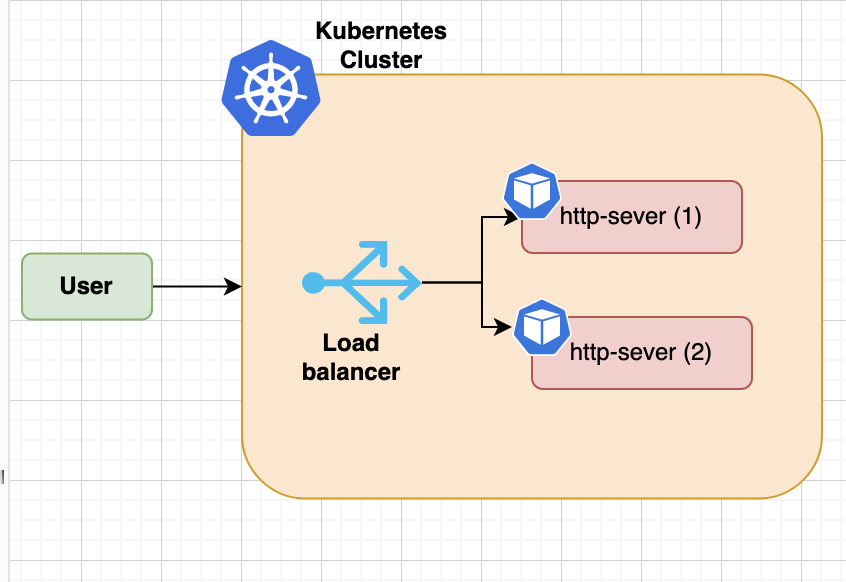

# http_server
A dead simple Ruby web server. Serves on port `SERVER_PORT`.
- /healthcheck path returns "OK"
- All other paths return "Well, hello there!"

`$ ruby http_server.rb`

## Requirements

The following versions are the ones I used. Later or earlier version may work as well.

- Terraform `v0.12.16`
- Kubectl `v1.20.12`
- Minikube `v1.25.1` (Using the hyperkit driver)
- Docker for desktop (MacOS) `v20.10.12`
- Helm `v3.4.0`

## Setup instructions

1. `minikube start`
2. Make sure `Docker Engine` is running.
3. `make deploy IMAGE_TAG=<version>`
    - Build a docker image
    - Load it to minikube
    - Use `helm_release` terraform resource to deploy `http-server` helm chart.
    - Return the `http-server` URL

4. Open the returned URL `http://<url>`

## Setup architecture

The following is the Kubernetes cluster setup

Minikube is used to spin it up. The `http-server` is packaged in a Helm chart and that chart is deployed with Terraform.

## Future improvements

- Use `ingress-dns` addons for minikube to bind to .test local domain for example.
- Setup TLS https://minikube.sigs.k8s.io/docs/handbook/untrusted_certs/
- Add stress test script. For example using https://docs.locust.io
- Improve Pods scaling using a request based metrics instead of resource utilization. 
https://kubernetes.io/docs/tasks/run-application/horizontal-pod-autoscale-walkthrough/#autoscaling-on-multiple-metrics-and-custom-metrics
- define `seccomp` profile and attached to the k8s deployment.